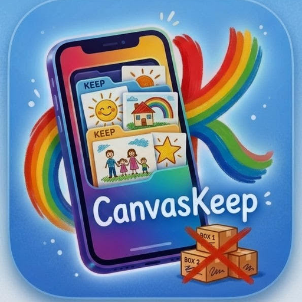

# CanvasKeep

**Preserve the canvas. Keep the memory.**

*A private, offline-first home for your child's artwork — every crayon, every grade, every year.*

---

## The fridge can only hold so much.

Every parent knows the feeling. A stack of papers on the counter. A drawer of dried-out finger paintings. A photo on your phone that you'll *definitely* go back and label later. (You won't.)

Years from now, your kid will ask: *"Mom, do you still have that dragon I drew in kindergarten?"*

CanvasKeep is the answer.

---

## A museum for your kid's art. Right on your phone.

Snap a photo. Pick the child. Done.

CanvasKeep does the rest — calculating their age and grade from the date, organizing by child, and presenting each piece in a dark, gallery-quality **Studio** mode that makes a crayon dinosaur look like it belongs at the MoMA.

Because it does.

---

## What it does

🎨 **Capture in seconds.** Photo, title, date — that's it. Notes optional. Sample data on first launch so you can play before you commit.

👧 **Organized around your kids.** Add each child once with their birthday and school start date. CanvasKeep figures out their age and grade for every piece automatically.

🏛️ **Studio mode.** A dark, ambient gallery view where each piece sits in a glowing purple frame with a museum plaque underneath. Swipe through the years. It is, frankly, beautiful.

📅 **Timeline that grows with them.** From "scribbled at 2" to "watercolor at 14" — every piece in context.

💾 **Yours. Forever.** Everything stays on your device. No cloud upload, no account, no algorithm deciding what's worth keeping. Export the whole archive as JSON whenever you want.

🌐 **Works offline.** Drop it on your home screen and use it on a plane, at the cabin, anywhere. Install once, runs forever.

🌗 **Dark luxury or warm cream.** Two themes, both polished. Switch instantly.

---

## Why I built this

I'm a dad. My son's preschool sent home thirty pieces of art last semester. Thirty. I kept the best three and felt like a monster about the rest.

There had to be a better way than "decide right now, in this moment, which of your child's creations is worth saving forever." So I built one. Take the photo. Toss the paper (or don't — but you *can*). The memory is preserved either way.

CanvasKeep is part of a small family of tools I'm building at **[JVox.org](#)** — a non-profit focused on AI and accessibility technology for families. The other projects there started with my non-verbal son. This one started with the recycling bin.

---

## The studio

This is where CanvasKeep stops being a utility and starts being magical.

Tap **Studio** and the chrome falls away. The lights go down. Each piece of art appears in a softly glowing purple frame against deep midnight. Below it, a museum-style plaque with the child's name, their age and grade at the time, and any notes you saved.

Swipe left, swipe right. Years of work, presented like it deserves to be.

Show it to your kid on their 18th birthday. I dare you not to cry.

---

## Privacy, plainly

- **Nothing leaves your device.** Photos, names, birthdays, notes — all stored locally in your browser.
- **No account. No login. No email collection.**
- **No analytics, no ads, no tracking pixels.** Open the network tab and check. (Web fonts from Google Fonts on first load are the only outbound request, and they're cached forever after.)
- **Export anytime.** Your data is yours. JSON export gives you the full archive, photos and all, in a single file.

---

## Install it

Open CanvasKeep in any modern mobile browser. Tap your browser's **share** menu, then **Add to Home Screen**. That's it. From there it launches like any other app — full screen, no browser UI, works offline.

On desktop, Chrome and Edge will show an install icon in the address bar. Same idea.

---

## Coming soon

- 📤 **Share to anywhere** via the native share sheet — Messages, AirDrop, Instagram, email
- 🖼️ **Year-end memory book** export as a PDF
- 🎬 **Slideshow mode** for birthdays and family gatherings
- ✂️ **Background removal** so a single photo of a piece on the kitchen floor looks frame-ready
- 📱 **Apple Watch glance** showing today's most recent addition

Have an idea? Open an issue. This thing belongs to the families who use it.

---

## Built with

CanvasKeep is a single-file HTML progressive web app. No React build, no npm install, no server. View source and read the whole thing — it's all right there.

Design system: **Lazzaro Standard** — dark luxury with grape `#9B5DE5`, coral `#FF6B6B`, sky `#4ECDC4`, sun `#FFD166`, on warm cream `#FFF9F0`. Fonts: **Fredoka One** for display, **Nunito** for everything else.

---

### Save your children's art.
### Not the clutter.

**[CanvasKeep](#)** — a project of [JVox.org](#)

*Made for parents. By a parent. With love.*

